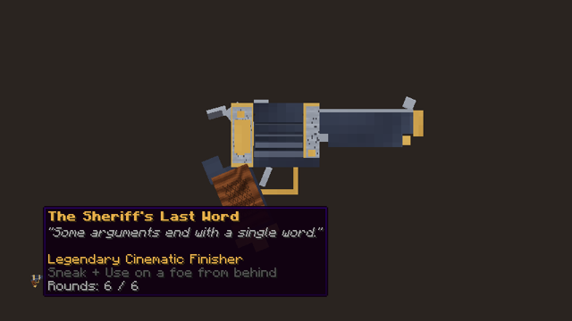
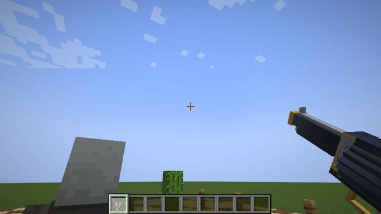
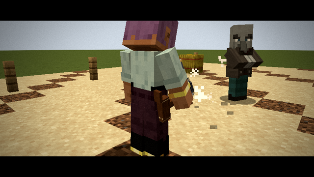
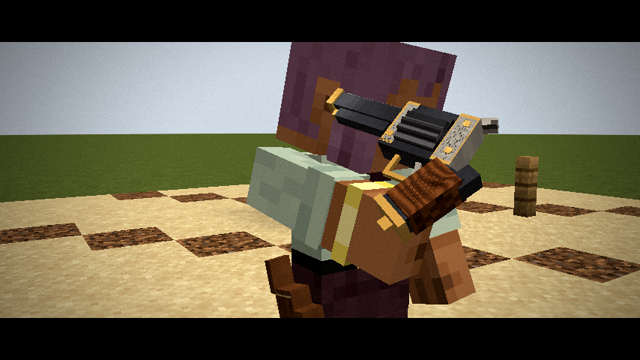
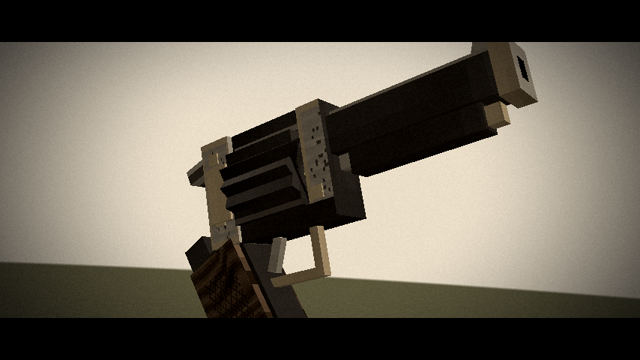
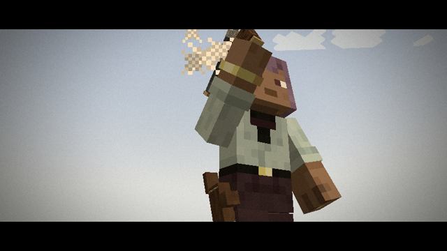
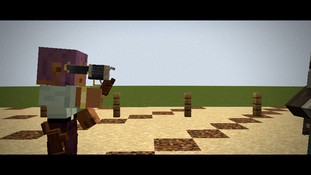
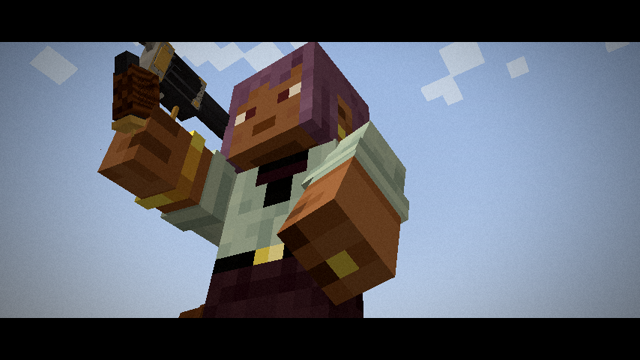
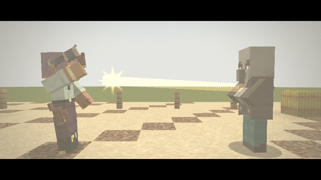
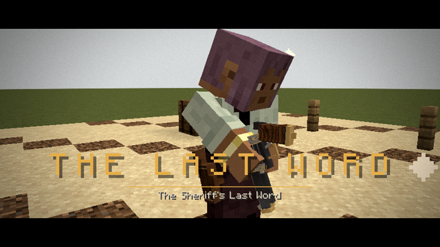

# FINAL FRAME — Cinematic Finisher Weapons

A Minecraft **1.21.1 / NeoForge** mod that adds *Cinematic Finisher Weapons*: weapons that start a fully
choreographed action sequence with its own camera, body animation, effects and sound design.

The first release contains one weapon: **The Sheriff's Last Word**, a legendary revolver.

## The Sheriff's Last Word

* **Built from a real 3D model.** The revolver has a separate frame, cylinder and hammer (`tools/gen_models.py`). It has a blued
  barrel, an engraved recoil shield, a brass muzzle band, screws, loading gate and lanyard ring, a checkered walnut grip,
  a trigger guard and a fluted cylinder with chambers and brass case rims. A custom item renderer draws the parts so the cylinder
  indexes and the hammer cocks and falls. The same model is used in the inventory, both hands, first person, on the ground and
  in a leather hip holster.
* **Works as an everyday sidearm.** It is a six-shot hitscan revolver with a muzzle flash, ember tracer, recoil kick, hammer fall and
  re-cock, cylinder indexing and a reload spin. Selecting it plays a draw twirl.
* **Sneak and use it on a mob from behind** to deliver **The Last Word**.

### Activation

1. Hold the revolver and approach an eligible mob from **behind**. By default you must be within a 110° cone and 3 blocks.
2. A prompt under the crosshair tells you whether the finisher is ready, and if not, what is missing: get behind them, get
   closer, sneak, or wait for the cooldown.
3. **Sneak and use** the revolver on the mob. You shoulder-check it. It stumbles forward, partly turns toward you and staggers,
   and the camera takes over at the moment it stumbles.

The checks run on the server: cooldown, eligibility, range, the behind-angle, a required sneak (so ordinary combat never
triggers it), and a guard so only one finisher runs per performer and per target. Bosses and awkward mobs are excluded through
the `finalframe:finisher_immune` entity tag.

### The sequence (about 10.6 seconds, 212 ticks)

| Scene | Ticks | What happens | Camera |
|---|---|---|---|
| 1. The shove | 0–22 | Wind-up, a two-handed shove with a body lean and step, a dust burst, and the target stumbling with a partial turn | Gameplay, then a blend to over-the-shoulder at the moment of impact (with impact shake) |
| 2. The draw | 22–48 | Hand to the holster, the draw, a triple spin around the finger, the catch | A slow lateral orbit from behind-right to front-right; focus moves from the hip to the hand |
| 3. The flourish | 48–84 | Finger spins, a full wrist roll, a backward flip into a firing grip, the hammer cocked, the cylinder rolled, an aiming stance | A close orbit that pushes in on the hammer and cylinder, then pulls back |
| 4. The throw | 84–124 | The revolver is tossed and spins vertically. Time slows, the world desaturates, and the revolver hangs at its peak | Front-low wide shot, tracking the revolver upward, then a slow orbiting close-up at the peak |
| 5. The catch | 124–134 | A low-angle catch timed to the revolver's position and rotation (it lands on a whole number of turns), then time resumes | A low-angle hero shot, a push-in and an impact shake |
| 6. The Last Word | 134–162 | The target raises its hands. One decisive shot with a muzzle flash, a glowing trail, a shockwave ring, and a gold, non-graphic defeat burst | Barrel close-up, side profile, the target's view, a low hero shot, then a wide shot for the fire |
| 7. The final pose | 162–212 | Ducked world audio, ringing ears, smoke curling from the barrel, a guitar stinger, a final spin and the holster | Smoke close-up, then a slow pull-away that blends back into gameplay |

The title card ("THE LAST WORD") fades in during scene 7.

## The cinematic engine

| Piece | Where | Role |
|---|---|---|
| Finisher framework | `finisher/` | `FinisherDefinition` (timeline, deterministic target path, server beats), `Timeline` + `FinisherPhase` state machine (IDLE → ACTIVATION → SHOVE → DRAW → FLOURISH → THROW → CATCH → AIM → FIRE → FINISH → RESTORE), `FinisherRules`, `FinisherManager` |
| Server authority | `FinisherManager` | Validates activation and holds performer and target on their marks. Freezes the target's AI and restores it afterwards, protects both actors, broadcasts every sound and particle once, and applies world slow motion (single player only). Restores all state on completion **or** interruption: death, logout, a dimension change, a weapon swap, or the target vanishing |
| Protocol | `network/FFNetwork` | `Start` (a snapshot plus elapsed ticks, so late trackers join mid-sequence), periodic `Sync`, and `End(aborted)` |
| Choreography | `client/choreo/` | One `Choreography` per finisher. It is a pure function of the snapshot and the fractional tick, so every client renders the same frame |
| Camera | `client/camera/` | An edit decision list (`ShotList`) of hard cuts and eased blends, orbits, tracking shots and push-ins. Also trauma-based shake, camera roll, FOV, collision avoidance with smoothing, and an abort hand-back |
| Animation | `client/anim/`, `HumanoidModelMixin`, `EntityPoses` | Keyframed limb tracks, whole-body leans, and exact visual placement of both actors, independent of network interpolation |
| Presentation | `client/render/` | A western color-grade post shader (saturation, warmth, contrast, vignette, flash, grain), letterbox bars, the title card, world effects, and audio ducking |

### Adding a future finisher weapon

1. Extend `FinisherWeaponItem` and return your `FinisherDefinition` from `finisher()`.
2. Implement the `FinisherDefinition`: the timeline, `planTargetEnd`, `targetMotion` and `serverTick` beats. Register it with
   `FinisherRegistry.register(...)`.
3. Implement a `Choreography` for the camera shots, poses, weapon state, world effects and grade. Register it with
   `Choreographies.register(id, ...)` on the client.

The camera controller, state management, networking, input lock, protection, restoration, HUD and grade all work unchanged.

## Configuration

* **Server** (`finalframe-server.toml`, synced to clients): activation range, behind-angle, require sneak, cooldown,
  player targets, maximum target height and health, world slow motion and its factor, invulnerability during the
  finisher, and shot damage.
* **Client** (`finalframe-client.toml`, or the in-game Mods → Config screen): letterbox, color grading, camera-shake multiplier
  (0 turns shake off), world-audio ducking, title card, activation prompt and holster rendering.

## Building

```bash
./gradlew build          # jar in build/libs/
./gradlew runClient      # play in a dev client
```

Assets are generated with plain Python, plus ffmpeg for the sounds, so the mod ships no third-party media:

```bash
python3 tools/gen_textures.py   # 32x32 textures: blued/polished/engraved steel, walnut, brass, leather, cylinder faces, muzzle flash
python3 tools/gen_models.py     # multi-part revolver and holster models
python3 tools/gen_sounds.py     # 20 synthesized effects: gunshots, mechanics, foley, slow-mo, ear ring, guitar stinger
```

`./gradlew runAutotest` starts a scripted showcase. It builds a flat test world, stages a target, fires the revolver and
performs the finisher, saving screenshots of every beat to `run-autotest/screenshots/`. It also runs headless under
`xvfb-run`.

Crafting recipe: three iron ingots across the top row; gold ingot, diamond and gunpowder in the middle row; any planks in
the bottom-right slot.

## Screenshots

Captured by `./gradlew runAutotest` with software rendering (no shaders or resource packs):

| | |
|---|---|
|  |  |
| Draw orbit —  | Flourish —  |
| Peak of the throw —  | The catch —  |
| Side profile —  | Hero shot —  |
| The Last Word —  | Final pose —  |
